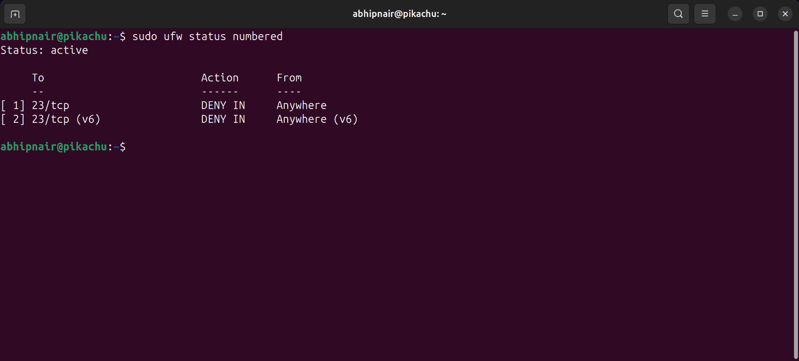
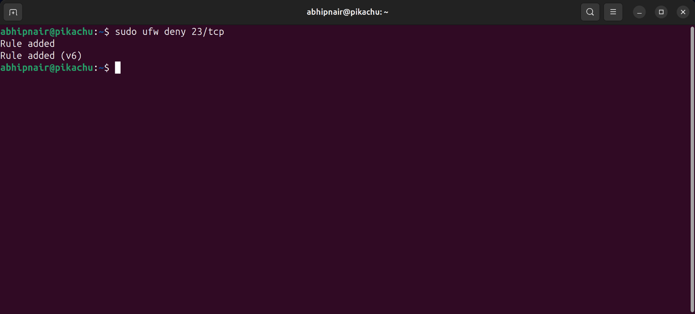
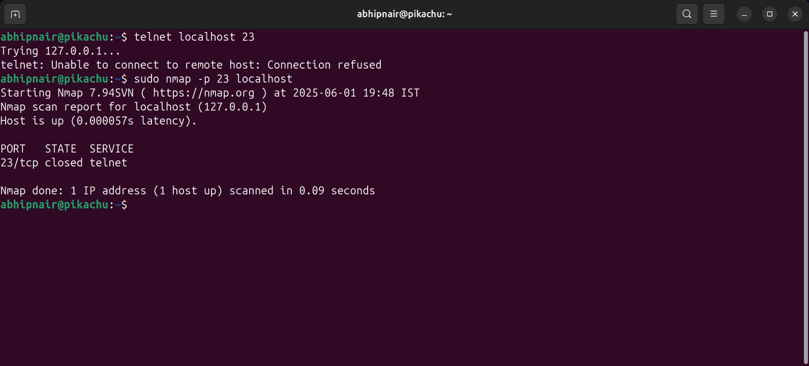
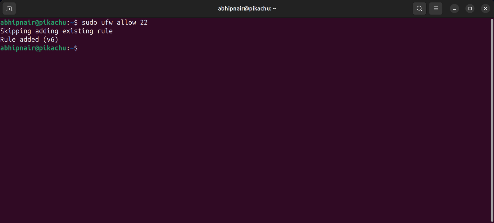
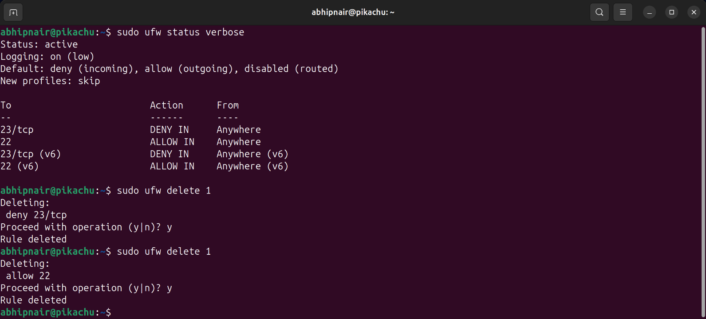

# 🛡️Task 4: Linux Firewall Configuration Guide with UFW

This guide provides a concise yet comprehensive overview of using the Uncomplicated Firewall (UFW) on Linux systems to manage and secure network traffic.

---

## 1. ✅ Install and Enable UFW

Ensure UFW is installed and active:

```bash
sudo apt update && sudo apt install ufw -y
sudo ufw enable
```

2. 📋 Check Firewall Status and Rules

Check current firewall status and existing rules:

    sudo ufw status verbose

To see numbered rules:

    sudo ufw status numbered


3. 🚫 Block Inbound Traffic on Specific Port (e.g., Telnet - Port 23)

    sudo ufw deny 23/tcp



4. 🧪 Test the Firewall Rule

Use tools like telnet, netcat, or nmap:

    telnet localhost 23
    nc -zv localhost 23
    nmap -p 23 localhost



5. ✅ Allow SSH Port (22)

To prevent locking yourself out:

    sudo ufw allow 22/tcp



6. ❌ Remove Test Rule (Revert Changes)

Delete by service/port:

    sudo ufw delete deny 23/tcp

Or delete by number:

    sudo ufw status numbered
    sudo ufw delete <rule_number>



7. ⚙️ Additional Configurations

Allow a port range:

    sudo ufw allow 1000:2000/tcp

Deny specific IP:

    sudo ufw deny from 203.0.113.10

Allow SSH from specific IP:

    sudo ufw allow from 192.168.1.100 to any port 22

Limit SSH (against brute force):

    sudo ufw limit ssh

8. 🔁 Reset UFW Rules

This will disable UFW and clear all rules:

    sudo ufw reset

9. 🧱 Set Default Policies

Default settings to block all incoming and allow all outgoing:

    sudo ufw default deny incoming
    sudo ufw default allow outgoing

🧾 Summary Table

| Action                 | Command Example                                                     |
| ---------------------- | ------------------------------------------------------------------- |
| Enable Firewall        | `sudo ufw enable`                                                   |
| Check Status           | `sudo ufw status verbose`                                           |
| Block Telnet (Port 23) | `sudo ufw deny 23/tcp`                                              |
| Allow SSH (Port 22)    | `sudo ufw allow 22/tcp`                                             |
| Remove Block Rule      | `sudo ufw delete deny 23/tcp` or `sudo ufw delete <rule_no>`        |
| List Rules Numbered    | `sudo ufw status numbered`                                          |
| Limit SSH              | `sudo ufw limit ssh`                                                |
| Allow From Specific IP | `sudo ufw allow from 192.168.1.100 to any port 22`                  |
| Deny From Specific IP  | `sudo ufw deny from 203.0.113.10`                                   |
| Allow Port Range       | `sudo ufw allow 1000:2000/tcp`                                      |
| Reset Firewall         | `sudo ufw reset`                                                    |
| Set Default Policies   | `sudo ufw default deny incoming && sudo ufw default allow outgoing` |

📌 Notes

    Always allow SSH before enabling the firewall on remote systems.

    After major changes, check status using sudo ufw status verbose.

    Use ufw logging on for basic logging or configure more with rsyslog.

📚 References

    [UFW Manual](https://manpages.ubuntu.com/manpages/focal/en/man8/ufw.8.html)

    [Ubuntu UFW Documentation](https://help.ubuntu.com/community/UFW)

